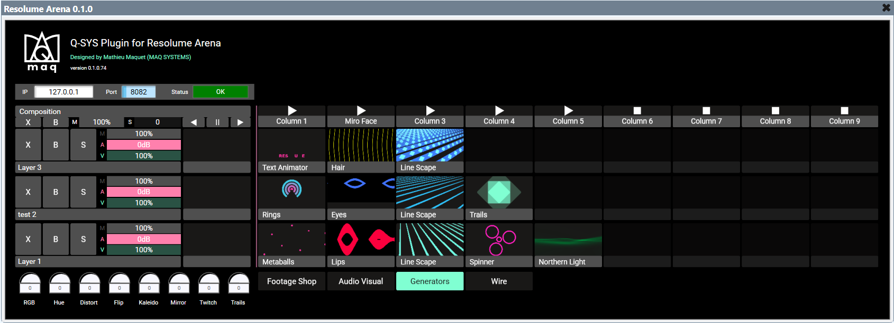

# Resolume Arena Q-SYS Plugin

A Q-SYS Control plugin for operating a Resolume Arena composition from a Q-SYS
Core. Its single-page interface mirrors the essential Resolume Composition workflow
while exposing stable control pins for integration into a design or custom UCI.

## Requirements

- Q-SYS Designer 10.4 or later (validated with 10.4.0)
- Resolume Arena 7 with its REST/WebSocket Webserver enabled (validated with
  Arena 7.27.1 rev. 15990)
- Network access from the Q-SYS Core to the Resolume computer

## Installation

Download and open `ResolumeArena.qplug`. Q-SYS Plugin Helper automatically copies
the plugin to the correct Q-SYS Designer plugin directory. Then add **Resolume
Arena** from the User Components section.

## Resolume setup

Enable the Webserver in Resolume Arena preferences. Its default port is `8080`.
Enter the Resolume computer's IP address and configured port in the header of the
**Composition** page. Its Connection indicator and status text report availability,
WebSocket state and automatic reconnection.

## Properties

These properties determine the fixed control count and cannot change at runtime:

| Property | Range | Default | Purpose |
| --- | ---: | ---: | --- |
| Deck Count | 1–16 | 4 | Number of deck buttons |
| Maximum Column Count | 1–32 | 9 | Maximum visible columns |
| Maximum Layer Count | 1–16 | 3 | Maximum visible layers |
| Look and Feel | Resolume / Q-SYS | Resolume | SVG-inspired or native control appearance |

Set the counts to the largest composition the design must support. Controls that
do not exist in the current Resolume composition are cleared and disabled.

## Controls

- deck selection, column triggering and clip connection with realtime feedback;
- clip names, thumbnails and active-state outlines;
- composition Clear, Bypass, Master, Speed and global transport direction;
- per-layer Clear, Bypass, Solo, Master, Audio and Video controls;
- the active clip thumbnail and title for every layer;
- all eight native Composition Dashboard Links, discovered by Resolume parameter
  ID and labelled with their assigned names;
- realtime name updates for clips, layers and Dashboard Links.

Buttons are Toggle controls, but Resolume remains authoritative: after a command,
the displayed state follows confirmed API feedback rather than the local click.

## Connection and resource behavior

The plugin maintains one WebSocket connection and uses a five-second lightweight
`/api/v1/product` health request to detect a disabled Webserver. Composition and
parameter state are event-driven; there is no periodic composition polling.

Large WebSocket messages are reassembled in a bounded buffer. Thumbnail downloads
are limited to four concurrent requests and cached by clip identity/version, with
a maximum of 256 cached images. Rapid deck changes use bounded stabilization
requests so partial Resolume snapshots converge without an unbounded request loop.

## Known limitations

- Resolume may return HTTP 404 for the thumbnail of an active clip belonging to a
  non-selected deck that has not yet been exposed during the current connection.
  The plugin displays a subtle unavailable-image icon until Resolume makes the PNG
  available; the active clip title remains visible.
- Dashboard controls cover Resolume's eight native Composition Dashboard Links.
- Interface dimensions and generated pin counts depend on the design-time count
  properties. Changing them regenerates the corresponding controls.
- The Resolume-inspired SVG appearance may not transfer ideally when controls are
  copied into a custom UCI. Select the **Q-SYS** look for native Q-SYS buttons.

## References

- [Resolume REST API](https://resolume.com/docs/restapi/)
- [Resolume WebSocket API](https://www.resolume.com/support/en/websocket-api)
- [Bitfocus Companion Resolume module](https://github.com/bitfocus/companion-module-resolume-arena)

## License

This project is licensed under the [MIT License](LICENSE).
